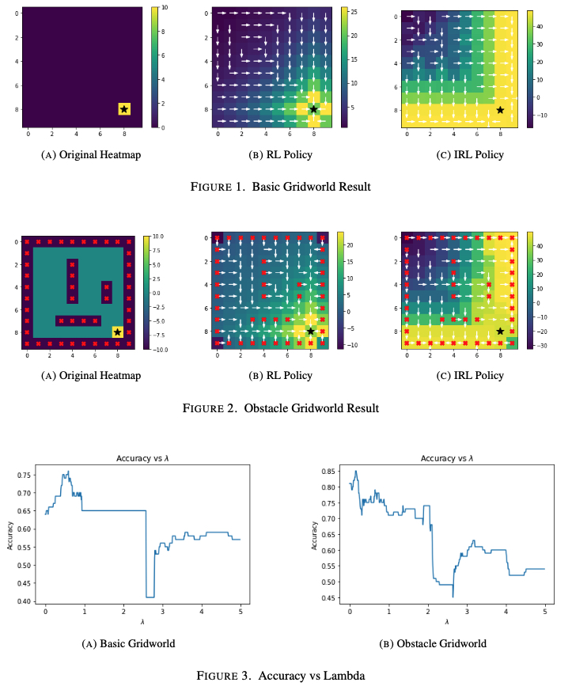
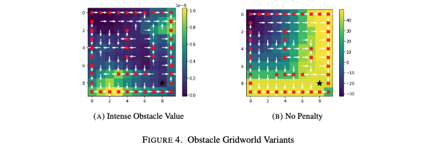

# RL Project: Inverse Reinforment Learning on Gridworld

**Authors**: Yifei Li, Ziyu Guo, Zeyu Chen

*Abstract*: This work compares **Reinforcement Learning (RL)** and **Inverse Reinforcement Learning (IRL)** models on different Gridworld environments in order to explore the difference of them and find the limitations and the potential improvements of Inverse Reinforcement Learning algorithm. By formulating it as an optimization problem, we extra a reward function given the trained expert policy to mimic the observed behavior. We shows empirically that the while IRL can generate a similar policy, it’s not likely the identical policy and thus is sub-optimal. The more complex the scenario is, the worse the IRL performs. As for the further work, it’s necessary to research more how to define the optimal policy and to numericalize and compare the policy difference.

For more details, please see the [report](report.pdf) and [notebook](irl-gridworld.ipynb).

## Results

<h1 align="center">
  
</h1> 

<h1 align="center">
  
</h1> 
